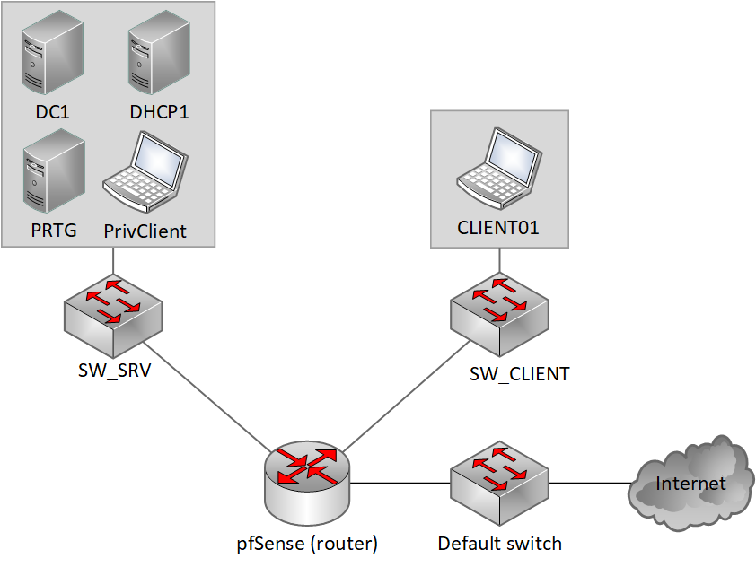

# Windows Server Infrastructure Lab

A virtualised small-enterprise environment built in Hyper-V as part of a system administration course. Two labs — the first focused on standing up the infrastructure, the second on identity management, access control and monitoring.

---

## Environment

Everything runs on a single physical host. Two private Hyper-V switches segment the network: one for servers and the admin workstation (SW_SRV), one for regular clients (SW_CLIENT). pfSense sits between them and the internet.

### Machines

| Hostname | Role | OS |
|---|---|---|
| pfSense | Router / Firewall | pfSense CE |
| DC1 | Primary Domain Controller + DNS | Windows Server 2025 |
| DC2 | Secondary DC + DNS (Server Core) | Windows Server 2025 |
| DHCP1 | DHCP Server + File Server | Windows Server 2025 |
| PRTG | Monitoring | Windows Server 2025 |
| PrivClient-PAW | Privileged Access Workstation | Windows 11 Enterprise |
| CLIENT01 | Standard client | Windows 11 Enterprise |

---

## Key design decisions

**Network segmentation** — Servers and clients are on separate subnets. A client machine can't directly reach any server without going through pfSense. This is enforced by the private switch setup, not just firewall rules.

**Privileged Access Workstation** — PrivClient-PAW lives on the server network. All administration happens from here. The named admin account is restricted at the DC level so it can only authenticate from PrivClient-PAW — if someone tries to use those credentials from CLIENT01, it's denied regardless of the password being correct.

**Two domain controllers** — DC2 runs Server Core (no GUI) and was promoted remotely from PrivClient-PAW. If DC1 goes down, authentication and DNS keep working. DC2 is set as secondary DNS everywhere.

**DHCP moved from pfSense to Windows Server** — pfSense runs a relay on the client interface that forwards DHCP broadcasts to DHCP1. The server subnet has no DHCP at all — everything there is static.

**DHCP1 doubling as file server** — Not ideal, but a resource constraint. The shares live on a separate disk partition from the OS to keep things clean.

---

## Documentation

- [`docs/network.md`](docs/network.md) — IP scheme, pfSense config, WAC setup
- [`docs/active-directory.md`](docs/active-directory.md) — OU structure, users, groups, GPOs, DC2 Server Core setup
- [`docs/rbac-shares.md`](docs/rbac-shares.md) — File share permissions using AGDLP

## Scripts

See [`scripts/`](scripts/) — PowerShell for bulk AD setup and a health-check script. Each script has a config block at the top; copy `.env.example.ps1` and fill in your values before running.

---

## Screenshots

See [`screenshots/`](screenshots/) for evidence from the finished environment.
